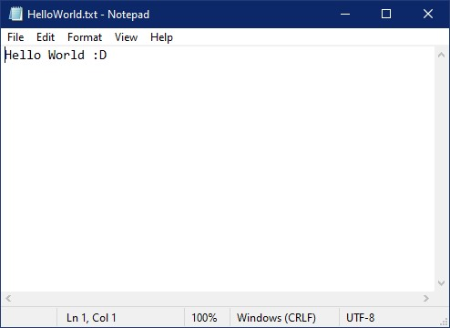

# WissenschaftlichesArbeiten_HelloWorld
This repository contains the code for the hello world program.
The program can print *Hello World :D* to an automatically generated text file.
The generated file will look like this:

## Prerequisite to use this program
To use this program, you need python installed. You can download the current python version here(https://www.python.org/downloads/).
